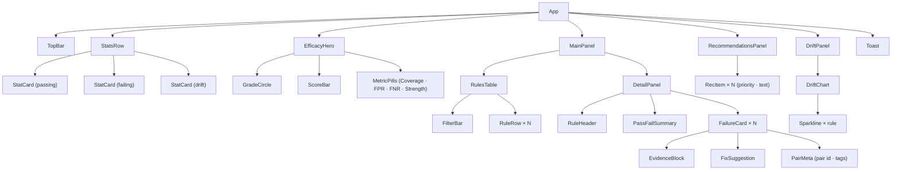
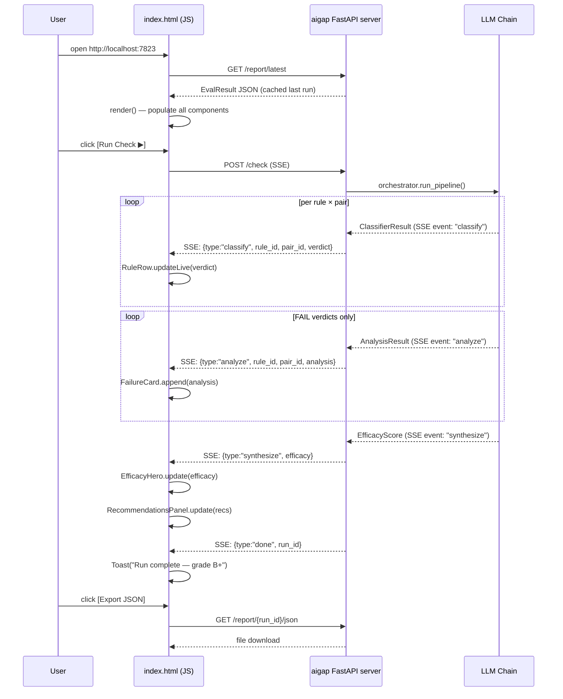
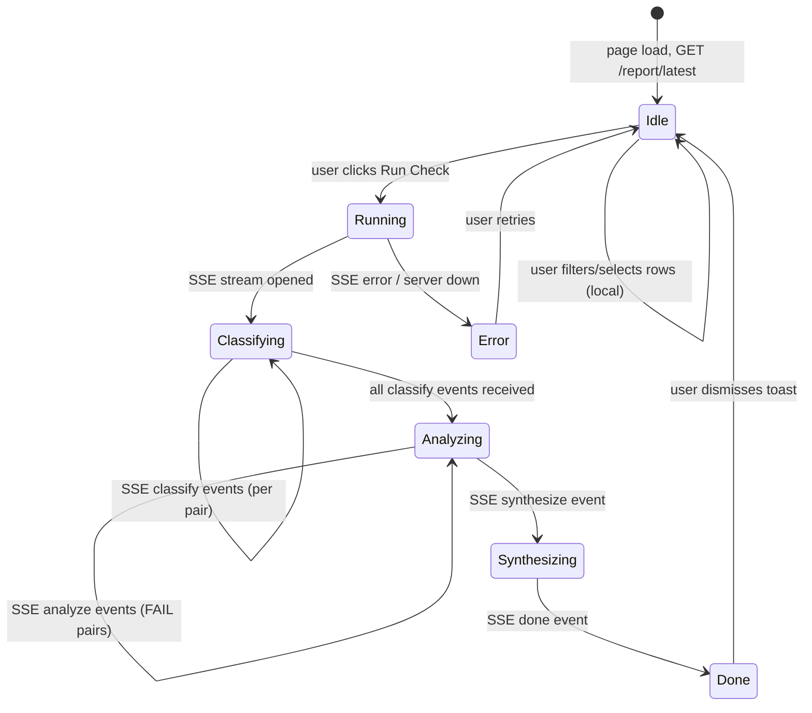
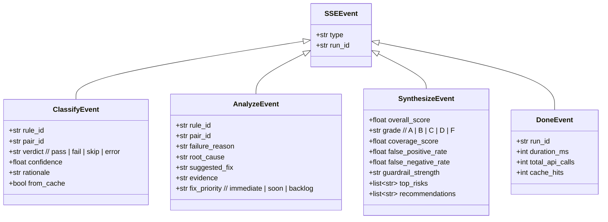
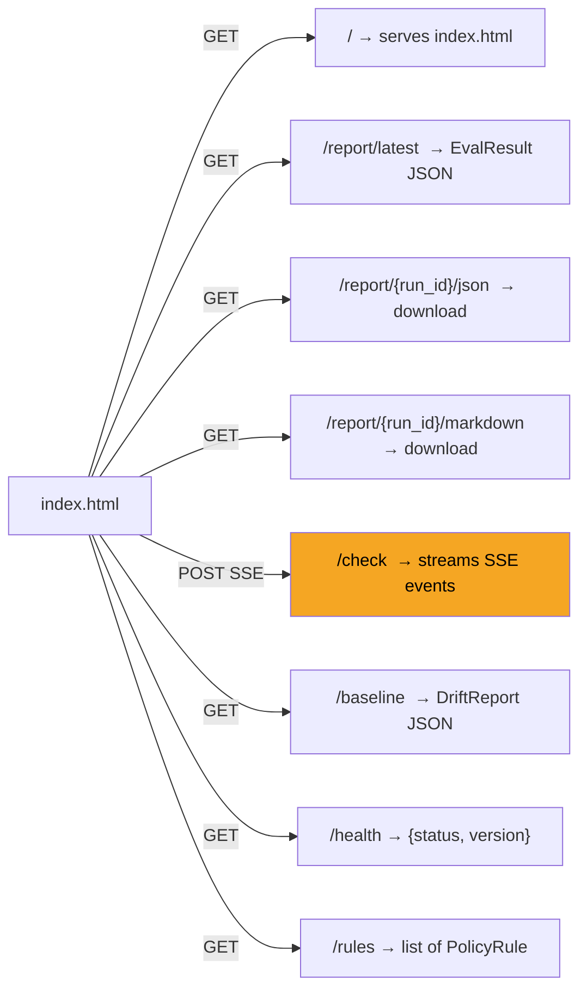
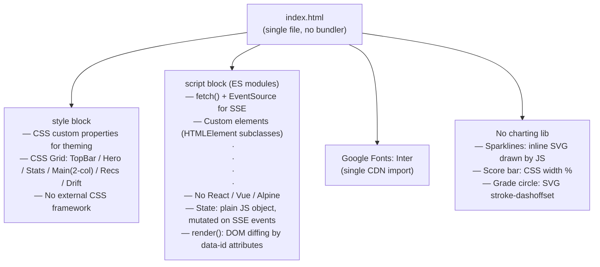

# aigap Dashboard — index.html Design

All diagrams below define the structure, data flow, and interactions for
`aigap/server/static/index.html` — the web report dashboard served by `aigap serve`.

---

## 1. Page Layout (wireframe)

```mermaid
graph TD
    PAGE["index.html"]

    PAGE --> TOPBAR["── TopBar ──────────────────────────────────────\n  [aigap logo]  Policy: My App Policy  Run: #a1b2c3  2026-04-19 14:32\n  [Run Check ▶]  [Export JSON]  [Export MD]\n────────────────────────────────────────────────"]

    PAGE --> HERO["── Efficacy Hero ───────────────────────────────\n  Grade: B+        Score: 81/100\n  ▓▓▓▓▓▓▓▓░░  Coverage: 85%   FPR: 3%   FNR: 8%\n  Guardrail strength: MODERATE\n────────────────────────────────────────────────"]

    PAGE --> STATSROW["── Stats Row (3 cards) ─────────────────────────\n  [✅ 11 Rules Passing]  [❌ 3 Rules Failing]  [⚠️ Drift: −4.2%]\n────────────────────────────────────────────────"]

    PAGE --> MAIN["── Main Panel (2-col) ──────────────────────────"]

    MAIN --> RULETABLE["Left: Rules Table\n  Filter: [All ▾] [Category ▾] [Severity ▾]\n  ┌─────────────────────────────────────────┐\n  │ Rule            Cat      Sev   Rate  Δ  │\n  │ no-pii-leakage  guard    CRIT  100% ──  │\n  │ cite-sources    policy   MED   72%  ↓   │\n  │ ...                                     │\n  └─────────────────────────────────────────┘\n  Click row → opens Detail Panel"]

    MAIN --> DETAIL["Right: Detail Panel\n  ┌─────────────────────────────────────────┐\n  │ Rule: cite-sources                      │\n  │ Pass: 18  Fail: 7  FP: 1  FN: 2        │\n  │                                         │\n  │ Failure #1 ─────────────────────────    │\n  │   Prompt: 'What causes inflation?'      │\n  │   Response: '...' (no citation)         │\n  │   Evidence: 'Prices rose in Q3'         │\n  │   Fix: Add [source] after factual claim │\n  │                                         │\n  │ Failure #2 ─────────────────────────    │\n  │ ...                                     │\n  └─────────────────────────────────────────┘"]

    PAGE --> RECS["── Recommendations (Opus output) ───────────────\n  1. HIGH  Strengthen cite-sources guardrail — 28% failure rate\n  2. MED   Add test coverage for jailbreak edge cases (0 pairs)\n  3. LOW   Consider language-detection plugin for english-only rule\n────────────────────────────────────────────────"]

    PAGE --> DRIFT["── Drift Chart ─────────────────────────────────\n  [sparklines per rule, last 5 runs]\n  no-pii-leakage   ──────────── 100%\n  cite-sources     ████▇▆▅▄ ↓  72%\n  english-only     ──────────── 95%\n────────────────────────────────────────────────"]
```

---

## 2. Component Hierarchy

---

## 3. Data Flow (server → UI)

---

## 4. State Machine (UI states)

---

## 5. SSE Event Schema

---

## 6. URL & API surface used by index.html

---

## 7. Tech stack (no framework, vanilla)

---

## Implementation decisions (resolved)

> `aigap/server/static/index.html` is fully implemented. Decisions below record what was chosen.

| # | Question | Decision |
|---|---|---|
| 1 | Single-file vs separate assets? | **Single file** — inlined CSS + JS, served directly by FastAPI `StaticFiles`. No bundler needed. |
| 2 | Dark mode? | **Dark by default** — GitHub-style dark palette (`#0d1117` bg) via CSS custom properties. Light mode not added yet. |
| 3 | Drift chart granularity? | **Last 5 runs** — `/history` endpoint is live and returns per-rule pass-rates from the latest report. |
| 4 | Live tail vs full refresh? | **Live cell-by-cell** — SSE `classify` events update pass-rate bars in real time; `synthesize` event refreshes the hero grade ring. |
| 5 | Auth for VS Code extension? | **None for now** — server is localhost-only. Token auth deferred to v2 alongside the extension. |

## Implemented

- `aigap/server/static/index.html` — vanilla JS, no framework, ~700 lines
- `aigap/server/app.py` — all endpoints wired: `/`, `/health`, `/report/latest`, `/report/{id}/json`, `/report/{id}/markdown`, `/baseline`, `/history`, `/rules`, `/check` (SSE)
- `aigap/server/sse.py` — `SSEQueue` bridges orchestrator `on_event` callback to FastAPI `StreamingResponse`
- `/check` triggers a real pipeline run via the orchestrator and streams live events to the dashboard
- SSE fallback: if server unreachable on page load or Run Check, dashboard renders from built-in mock data automatically

---

## See also — Runbooks

Full operational documentation lives in [`docs/runbooks/`](./runbooks/README.md):

| Runbook | Covers |
|---|---|
| [Getting started](./runbooks/getting-started.md) | Install, first run, dashboard |
| [Dashboard](./runbooks/dashboard.md) | Every panel, live run, export, API |
| [LLM chain internals](./runbooks/llm-chain.md) | Haiku → Sonnet → Opus, caching, cost |
| [Policy authoring](./runbooks/policy-authoring.md) | Writing `.aigap-policy.yaml` |
| [Plugin development](./runbooks/plugin-development.md) | Custom `PolicyPlugin` subclasses |
| [CI integration](./runbooks/ci-integration.md) | GitHub Actions, drift gate |
| [Baseline & drift](./runbooks/baseline-drift.md) | Tracking pass-rate changes |
| [Dataset management](./runbooks/dataset-management.md) | Golden datasets, labelling |
| [Troubleshooting](./runbooks/troubleshooting.md) | Errors and fixes |
